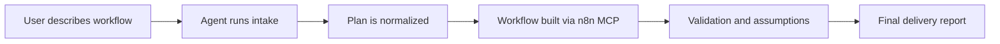

# ⚡ Vibeflow n8n

<div align="center">

### Build complete n8n workflows through MCP with any coding agent.

**Vibe code your automation. Let the agent handle the wiring.**

Create, update, and validate n8n workflows using **Codex CLI**, **Claude Code**, **OpenCode**, and other MCP-capable coding agents.

[](#-release-notes)
[](#-why-vibeflow)
[](#-supported-clients)
[](./LICENSE)
[](#-contributing)

</div>

---

## ✨ What is Vibeflow n8n?

**Vibeflow n8n** is an open-source skill kit for coding agents that lets anyone describe an automation in natural language and have the agent:

1. **ask the right questions**
2. **generate a structured plan**
3. **build the workflow in n8n through MCP**
4. **validate the result**
5. **return a clean implementation report**

Instead of wrestling with nodes, expressions, branching logic, and half-finished drafts, you get a guided workflow-building experience designed for **vibe coding with real structure**.

---

## 🔥 Why Vibeflow?

Most agent-based automation flows fail for predictable reasons:

* they start building too early
* they skip business rules
* they assume credentials and app behavior
* they produce fragile workflows with no validation
* they leave the user with a maze instead of an automation

**Vibeflow n8n** fixes that by forcing a better sequence:

* **brief first** 🧠
* **plan next** 🗺️
* **build with MCP** 🔧
* **validate before delivery** ✅
* **report what was done and what is missing** 📦

It is opinionated in the useful places and flexible where real-world workflows vary.

---

## 🧭 How it works



### The default flow

* **Intake**: understand goal, trigger, systems, outputs, business rules, and exceptions
* **Planning**: transform free-form input into a structured build plan
* **Execution**: create or update the workflow in n8n through MCP
* **Validation**: inspect missing credentials, placeholders, trigger logic, branches, and node naming
* **Delivery**: summarize what was created and what still needs manual configuration

---

## 🧩 Supported clients

Vibeflow is built for **MCP-capable coding agents**.

### Officially documented in this repo

* **Codex CLI**
* **Claude Code**
* **OpenCode**
* **Community / experimental MCP clients**

See:

* [`clients/codex/`](./clients/codex)
* [`clients/claude-code/`](./clients/claude-code)
* [`clients/opencode/`](./clients/opencode)
* [`clients/openclaude/`](./clients/openclaude)

---

## 🛠️ What you can build

### Growth and ops

* lead triage pipelines
* AI lead enrichment
* CRM qualification flows
* inbound webhook routers
* campaign handoff automations

### Support workflows

* support triage
* escalation routing
* Slack to Notion triage
* ticket classification and enrichment

### Finance and back office

* invoice reminders
* approval flows
* billing follow-ups
* notification pipelines

### AI-powered workflows

* summarize incoming data
* classify requests
* enrich records with LLM outputs
* hand off low-confidence cases for review

---

## 🚀 Quick start

### 1. Clone the repository

```bash
git clone https://github.com/domfelipe/vibeflow-n8n.git
cd vibeflow-n8n
```

### 2. Connect an MCP-compatible coding agent

Pick your client and configure it using the examples in the `clients/` folder.

### 3. Point your agent to Vibeflow instructions

Use the prompt and behavioral contract from:

* [`templates/system-prompt.md`](./templates/system-prompt.md)
* [`docs/conversation-contract.md`](./docs/conversation-contract.md)
* [`docs/skill-spec.md`](./docs/skill-spec.md)

### 4. Ask for a workflow

Example prompt:

```text
Build an n8n workflow that receives leads from a webhook, enriches them with AI, sends qualified leads to HubSpot, and notifies Slack when confidence is low.
```

### 5. Review the plan, then build

The agent should:

* ask follow-up questions only when needed
* create a structured plan
* build in n8n via MCP
* validate the result
* deliver a final report

---

## 🧠 Core design principles

### 1. Plan before touching n8n

No blind node generation.

### 2. Ask only what changes the build

No interrogation theater.

### 3. Defaults should be helpful

The agent should use safe, practical assumptions when possible.

### 4. Report assumptions clearly

What was inferred should never be hidden.

### 5. Output should be editable by humans

The workflow must still make sense inside n8n.

---

## 📁 Repository structure

```text
vibeflow-n8n/
├── clients/
│   ├── claude-code/
│   ├── codex/
│   ├── opencode/
│   └── openclaude/
├── docs/
│   ├── architecture.md
│   ├── conversation-contract.md
│   ├── getting-started.md
│   ├── github-launch.md
│   ├── install.md
│   ├── roadmap.md
│   └── tutorial-subir-github.md
├── examples/
│   ├── sample-plan.json
│   └── sample-workflow-export.json
├── recipes/
│   ├── ai-lead-enrichment.md
│   ├── customer-support-escalation.md
│   ├── hubspot-to-slack-qualification.md
│   ├── invoice-reminder.md
│   ├── lead-triage.md
│   ├── slack-to-notion-triage.md
│   └── support-triage.md
├── schemas/
│   └── plan.schema.json
├── templates/
│   ├── final-report-template.md
│   ├── intake-checklist.md
│   └── system-prompt.md
└── README.md
```

---

## ⚙️ Build contract

Vibeflow expects agents to move through these stages:

### Intake

Capture:

* workflow goal
* trigger type
* systems involved
* desired output
* business rules
* exceptions
* approval needs

### Planning

Generate a normalized plan with:

* summary
* trigger
* apps and services
* implementation steps
* edge cases
* validation checklist
* required credentials
* unresolved questions

### Execution

Use MCP to:

* create or update the workflow
* name nodes clearly
* preserve readability
* add placeholders where secrets are missing

### Validation

Check for:

* broken branches
* missing credentials
* malformed assumptions
* unclear node naming
* weak error handling

### Delivery

Return:

* what was built
* what was assumed
* what still needs manual setup
* how to test it
* suggested upgrades

---

## 📦 Example use cases

### Example 1: Lead routing

> “Build a workflow that receives website leads, scores them, enriches them with AI, and sends only qualified ones to HubSpot.”

### Example 2: Support escalation

> “Create a workflow that watches urgent support requests, classifies them, escalates high-risk cases to Slack, and creates a tracking record.”

### Example 3: Billing reminder

> “Build a recurring workflow that checks unpaid invoices every weekday and sends reminders only when due dates are inside policy.”

See the full set in [`recipes/`](./recipes).

---

## 🖼️ Demo flow

A clean public demo usually looks like this:

1. show the natural-language request
2. show the planning output
3. show the workflow created in n8n
4. show the final delivery report

Helpful references:

* [`docs/demo-script.md`](./docs/demo-script.md)
* [`docs/real-demo-playbook.md`](./docs/real-demo-playbook.md)
* [`docs/showcase-checklist.md`](./docs/showcase-checklist.md)

---

## 📚 Documentation

### Start here

* [`docs/getting-started.md`](./docs/getting-started.md)
* [`docs/install.md`](./docs/install.md)
* [`docs/architecture.md`](./docs/architecture.md)

### Agent behavior

* [`docs/skill-spec.md`](./docs/skill-spec.md)
* [`docs/conversation-contract.md`](./docs/conversation-contract.md)
* [`templates/system-prompt.md`](./templates/system-prompt.md)

### Publishing and community

* [`docs/github-launch.md`](./docs/github-launch.md)
* [`docs/community-onboarding.md`](./docs/community-onboarding.md)
* [`CONTRIBUTING.md`](./CONTRIBUTING.md)
* [`SECURITY.md`](./SECURITY.md)

---

## 🌍 Who is this for?

Vibeflow is a good fit for:

* automation builders using n8n
* developers who prefer CLI agents
* consultants delivering automation fast
* internal ops teams
* founders building workflows without a huge engineering ceremony
* anyone who likes **vibe coding**, but also likes finishing things

---

## 🧪 Status

Vibeflow is currently a **skill kit / workflow-building framework for coding agents**, with practical support material for MCP-based clients and progressive improvements across releases.

If you want the fastest route to value, start with:

* one recipe
* one client
* one end-to-end demo

Then expand.

---

## 🗺️ Roadmap

Planned areas of evolution:

* richer client-specific setup examples
* more production-grade workflow recipes
* exportable demo workflows
* stronger plan validation
* public demo assets and GIFs
* starter kits by domain

See [`docs/roadmap.md`](./docs/roadmap.md).

---

## 🤝 Contributing

Contributions are welcome.

You can help by:

* improving docs
* adding recipes
* refining client setup guides
* validating agent behavior in real workflows
* contributing examples and demos

Start here:

* [`CONTRIBUTING.md`](./CONTRIBUTING.md)
* [`.github/ISSUE_TEMPLATE/`](./.github/ISSUE_TEMPLATE)
* [`.github/DISCUSSION_TEMPLATE/`](./.github/DISCUSSION_TEMPLATE)

---

## 🛡️ Security

Please do **not** commit secrets, credentials, or private tokens.

If you find a security issue, check [`SECURITY.md`](./SECURITY.md).

---

## 📝 Release notes

Recent release materials:

* [`docs/release-v0.7.0.md`](./docs/release-v0.7.0.md)
* [`CHANGELOG.md`](./CHANGELOG.md)

---

## 💬 Community

This project is designed to become easier the more people share their patterns.

If you build something cool with Vibeflow:

* open a discussion
* share your workflow idea
* submit a recipe
* improve the docs for the next builder

---

## ⭐ Support the project

If this repo helps you build better automations:

* give it a star
* share it with your team
* open an issue with ideas
* contribute a recipe or improvement

That kind of signal helps the project grow legs.

---

## 📄 License

This project is available under the terms of the license in [`LICENSE`](./LICENSE).

---

<div align="center">

### ⚡ Vibeflow n8n

**Describe the workflow. Vibe code the idea. Let the agent build the machinery.**

</div>
